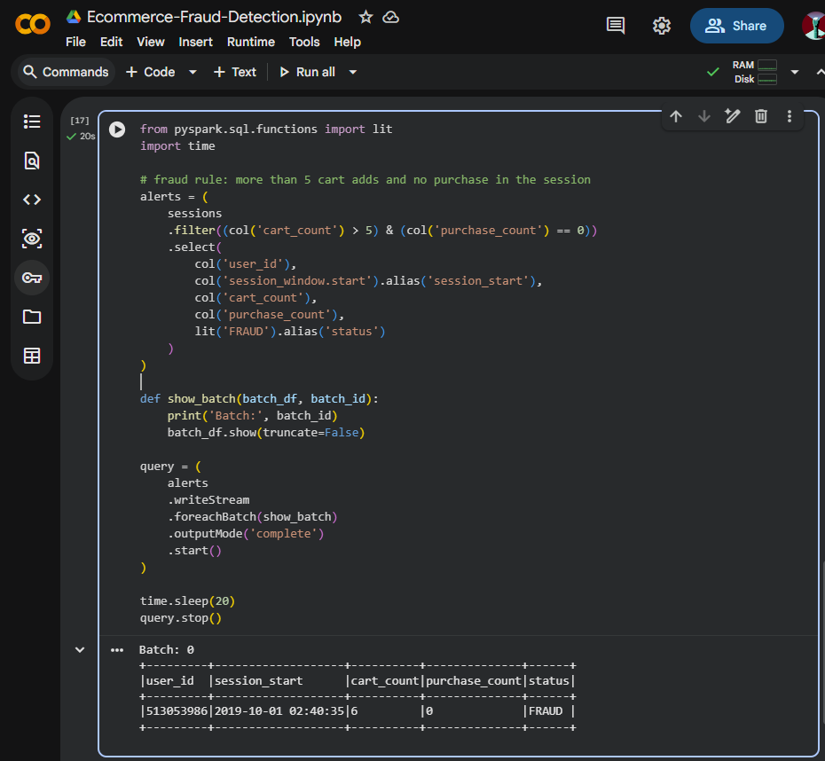

# E-commerce Fraud Detection (Spark Structured Streaming)

This is my assignment for scenario C of e-commerce fraud detection. I used spark structured streaming and session window.Basially it checks each users shopping session and if someone adds more than 5 items to cart but never buys anything it mark them as fraud. Because thats kind of a bot behavior.  

## dataset
I used the dateset from kaggle. The full file is realy big like 9GB+ so i only took the first 30000 rows as a sample. The assignment said 10k-50k is enoughh so i have chosen 30k. 

the columns are event_time, event_type, product_id, category_id, category_code, brand, price, user_id, user_session. I only used event_time, event_type, and user_id.

## how

I have used google colab and  run the cells one by one. Short code at a time.

- As i have tried several times so i need to unstallfirst then insall again  java and pyspark in cell 1. Should not run this one again after its done otherwise it breaks
- cell 2 starts spark and asked to upload kaggle.json (i got it from kaggle
settings > create legacy api key)
- cell 3 downloads the dataset from kaggle
- cell 4 unzips and makes the 30000 row sample
- cell 5 is the schema + session window
- cell 6 is the fraud check, it prints the alerts

## window type

I used sesion window with 30 min gap. I picked this because a shopping visit is not a fixed time. Some peple browse 5 min some 40 min. sliding window would cut the visit in pieces. Session window groups the events that happen close together and closes after 30 min of no activity so it fits better.

## where

The state is in the session part. spark has to remeber for each user which session is open and how many carts and purchase so far. That is kept in spark's state store. The watermark (10 minutes) is so the old state can be removed and memry doesnt blow up. The filter at the end (cart > 5 and purchase == 0) is not statful, it just checks one row.

## Issue

the event_time in the data was like "2019-10-01 00:00:00 UTC" with UTC at the end. spark couldnt read it as timetamp diretly so i had to remove the " UTC" part with regexp_replae and then convert with to_timestamp. After that the sesion window worked.

## output

it found 1 user in the sample:

```
Fraud alerts:
Batch: 0
+---------+-------------------+----------+--------------+------+
|user_id  |session_start      |cart_count|purchase_count|status|
+---------+-------------------+----------+--------------+------+
|513053986|2019-10-01 02:40:35|6         |0             |FRAUD |
+---------+-------------------+----------+--------------+------+
```

screenshot of the output:


